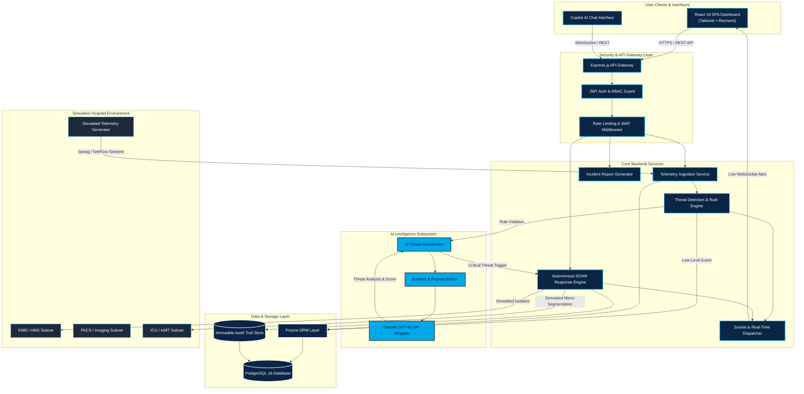
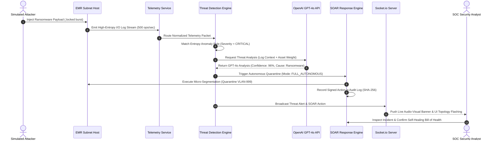

# 🏗️ System Architecture & Engineering Blueprint
## Aegis Guardian AI: AI-Powered Autonomous Cyber Defense System

**Document Version:** 1.0  
**Classification:** Enterprise System Architecture & Engineering Specification  
**Client (Academic Demonstration):** Quaid-e-Azam International Hospital (QIH), Rawalpindi, Pakistan  
**Facility Scope:** 400 Inpatient Beds, Emergency Center, Operating Theatres, ICUs (Adult, NICU, PICU), PACS/RIS, EMR, LIS, Pharmacy  
**Brand Identity Alignment:** Primary: Dark Blue (`#0B2545`), Accent: Cyan (`#00A8E8`), Secondary: White (`#FFFFFF`)  

---

> [!IMPORTANT]
> **ACADEMIC DEMONSTRATION & SIMULATION SAFEGUARD NOTICE:**  
> This architectural blueprint defines the structural design for **Aegis Guardian AI**, an academic research and technical demonstration platform engineered for healthcare cybersecurity. All live telemetry streams, network logs, security alerts, medical IoT metrics, user accounts, and patient records processed by Aegis Guardian AI are **100% synthetic and simulated**. Aegis operates in an isolated environment and does not execute physical network disruption or invasive commands on live medical devices or active clinical infrastructure at Quaid-e-Azam International Hospital.

---

## 1. Executive Summary

### 1.1 Architectural Vision
Aegis Guardian AI is designed as an enterprise-grade, high-throughput, autonomous Security Operations Center (SOC) and Security Orchestration, Automation, and Response (SOAR) architecture specifically tailored for modern healthcare environments. Healthcare IT networks are uniquely complex ecosystems where traditional IT infrastructure intersects with life-safety Medical IoT (IoMT) devices, high-bandwidth PACS imaging archives, and highly sensitive Electronic Medical Records (EMR).

The core architectural mission of Aegis Guardian AI is to bridge the latency gap between zero-day threat detection and incident containment. By leveraging an asynchronous telemetry ingestion pipeline, a hybrid heuristic/AI rule correlation engine powered by OpenAI (GPT-4o), and automated network micro-segmentation, Aegis Guardian AI reduces Mean Time to Detect (MTTD) and Mean Time to Respond (MTTR) to sub-second speeds.

### 1.2 Monitored Enterprise Scope
Aegis Guardian AI encapsulates end-to-end monitoring across QIH's digital footprint:

```
┌────────────────────────────────────────────────────────────────────────────────────────┐
│                              MONITORED HOSPITAL ECOSYSTEM                              │
├───────────────────────┬────────────────────────────┬───────────────────────────────────┤
│ Clinical Applications │ Diagnostic Infrastructure  │ Critical Care & Medical IoT       │
│ • EMR (MedRecords)    │ • PACS / RIS Gateway       │ • Adult ICU Telemetry             │
│ • HMS Core Engine     │ • Pathology LIS            │ • Neonatal ICU (NICU) Monitors    │
│ • Pharmacy Inventory  │ • MRI / CT / X-Ray / Mamm. │ • Pediatric ICU (PICU) Ventilators│
│ • Billing & OPD Portal│ • Blood Bank Management    │ • Dialysis Units & Infusion Pumps │
└───────────────────────┴────────────────────────────┴───────────────────────────────────┘
```

---

## 2. Architectural Goals & Design Principles

Aegis Guardian AI is engineered around six fundamental software architecture principles:

```
┌────────────────────────────────────────────────────────────────────────────────────────┐
│                              ARCHITECTURAL DESIGN PRINCIPLES                           │
├───────────────────────┬────────────────────────────┬───────────────────────────────────┤
│ Scalability & Speed   │ Defense-in-Depth Security  │ Fail-Open Life Safety Reliability │
│ • 5,000 logs/sec throughput│ • Zero-Trust Access & JWT  │ • Non-disruptive IO isolation     │
│ • Sub-second UI state │ • Encrypted DB & API TLS 1.3│ • Graceful AI Fallback heuristics │
├───────────────────────┼────────────────────────────┼───────────────────────────────────┤
│ Modular Clean Design  │ Immutable Audit Trace      │ Real-Time Event Velocity          │
│ • Layered Architecture│ • Append-only SHA-256 logs │ • Socket.io event streaming       │
│ • Strict Type Safety  │ • HIPAA / ISO 27001 Audit  │ • Sub-500ms SOAR micro-segment    │
└───────────────────────┴────────────────────────────┴───────────────────────────────────┘
```

1. **High-Throughput Scalability:** Asynchronous event queues and non-blocking I/O enable the backend to process up to 5,000 simulated telemetry log entries per second without degrading UI responsiveness.
2. **Defense-in-Depth Security:** Every system boundary enforces Zero-Trust principles. Authentication relies on short-lived JWT tokens, password hashing with `bcrypt` (cost factor 12), and strict Role-Based Access Control (RBAC).
3. **High Availability & Fail-Open Life-Safety:** Cyber defense actions must never compromise patient life support. Containment actions utilize software-level VLAN micro-segmentation rather than hard device shutdowns. If external AI services (OpenAI API) experience latency or outages, the system fails open to local heuristic detection rules.
4. **Maintainability & Clean Layered Architecture:** Clear separation of concerns between presentation components, business logic controllers, database persistence, and AI intelligence wrappers.
5. **Performance Excellence:** Frontend dashboard rendering completes in under 1 second using Vite and React 19, with optimistic UI updates powered by Zustand and React Query.
6. **Immutable Audit Traceability:** Every administrative modification, analyst override, and autonomous SOAR execution is signed with SHA-256 integrity hashes and recorded in append-only audit tables.

---

## 3. High-Level Multi-Tier Architecture

Aegis Guardian AI follows an N-Tier Decoupled Architecture model comprising six logical layers:

```
┌────────────────────────────────────────────────────────────────────────────────────────┐
│ 1. PRESENTATION LAYER (React 19, TypeScript, Vite, Tailwind CSS, Lucide Icons, Recharts)│
├────────────────────────────────────────────────────────────────────────────────────────┤
│ 2. SECURITY LAYER (JWT Auth Middleware, RBAC Guards, Rate Limiters, WAF Filter)       │
├────────────────────────────────────────────────────────────────────────────────────────┤
│ 3. BUSINESS LOGIC LAYER (Node.js, Express.js, Telemetry Controllers, SOAR Engine)     │
├────────────────────────────────────────────────────────────────────────────────────────┤
│ 4. AI & INTELLIGENCE LAYER (OpenAI GPT-4o Client, Prompt Builders, Context Engine)    │
├────────────────────────────────────────────────────────────────────────────────────────┤
│ 5. DATA PERSISTENCE LAYER (PostgreSQL 16, Prisma ORM, Connection Pool, Redis Cache)    │
├────────────────────────────────────────────────────────────────────────────────────────┤
│ 6. INFRASTRUCTURE & CONTAINER LAYER (Docker, Docker Compose, Vercel, Render / Railway)  │
└────────────────────────────────────────────────────────────────────────────────────────┘
```

### Layer Breakdown & Component Responsibilities

* **1. Presentation Layer:** Single Page Application (SPA) built with React 19 and TypeScript. Utilizes Zustand for lightweight client state, React Query for server state caching, Framer Motion for smooth transitions, and Recharts for live telemetry analytics graphs.
* **2. Security Layer:** Edge security and request validation middleware pipeline. Validates Bearer JWT tokens, enforces RBAC permissions based on user roles, applies IP rate-limiting, and sanitizes incoming payloads against XSS and SQL injection.
* **3. Business Logic Layer:** Modular Express.js services. Manages log ingestion endpoints, threat correlation algorithms, SOAR quarantine execution logic, report compilation workers, and real-time Socket.io event dispatchers.
* **4. AI & Intelligence Layer:** Isolated service layer handling OpenAI API interactions. Formats structured log context, injects system prompts, executes GPT-4o threat analyses, parses confidence scores, and powers the natural-language Copilot Security Assistant.
* **5. Data Persistence Layer:** PostgreSQL 16 relational database managed via Prisma ORM. Ensures ACID compliance for threat logs, user tables, asset mappings, and audit trails.
* **6. Infrastructure & Container Layer:** Containerized deployment using Docker and Docker Compose. Hosted across Vercel (Frontend SPA) and Render/Railway (Node.js API & Managed PostgreSQL).

---

## 4. Overall System Component Diagram

The following Mermaid graph visualizes the end-to-end component topology of Aegis Guardian AI:



---

## 5. Detailed Subsystem Architectural Breakdown

### 5.1 Presentation Subsystem (Frontend)
The user interface is designed as an executive, high-visibility dashboard adhering strictly to QIH brand tokens:

```
┌────────────────────────────────────────────────────────────────────────────────────────┐
│                                 FRONTEND ARCHITECTURE                                  │
├───────────────────────┬────────────────────────────┬───────────────────────────────────┤
│ State & Caching Layer │ UI Components              │ Real-Time Sync                    │
│ • Zustand (Global)    │ • Recharts (Telemetry)     │ • Socket.io Client                │
│ • React Query (Server)│ • Lucide React (Icons)     │ • Auto-Reconnecting WebSockets    │
│ • React Router v7     │ • Tailwind CSS UI Kit      │ • Audio-Visual Banner Pipeline    │
└───────────────────────┴────────────────────────────┴───────────────────────────────────┘
```

* **Component Structure:** Atomic design hierarchy separating layout shell, widgets, data tables, and modal dialogs.
* **Responsive Layouts:** Dark Blue (`#0B2545`) base theme with Cyan (`#00A8E8`) active elements, optimized for wall-mounted SOC monitors (1080p/4K) and desktop analyst workstations.

### 5.2 Core Telemetry Ingestion & Threat Detection Subsystem
The backend ingestion pipeline receives simulated log streams, normalizes incoming payloads, and executes pattern matching:

```
Raw Log Stream ──► Ingestion Buffer ──► JSON Normalization ──► Heuristic Rules ──► AI Analysis ──► SOAR
```

1. **Ingestion Buffer:** Accepts high-frequency POST payloads containing NetFlow, Syslog, WAF, and endpoint logs.
2. **JSON Normalization:** Enriches raw entries with metadata (Subnet ID, Asset Criticality Weight, Timestamp, Source IP).
3. **Rule Evaluation Engine:** Checks normalized events against pre-compiled signatures (e.g., mass file modifications, SQL injection AST structures, brute-force counts).

### 5.3 OpenAI GPT-4o AI Intelligence Subsystem
When a threat surpasses pre-configured anomaly thresholds, the event is delegated to the AI Analysis module:

```
Threat Context ──► System Prompt Builder ──► OpenAI GPT-4o API ──► Structured Parsing ──► Score Inject
```

* **Prompt Engineering Protocol:** Injects exact asset context (e.g., "Target: NICU Ventilator Subnet 192.168.4.12") and requires JSON-structured outputs containing:
  - `analysis`: Plain-language attack breakdown.
  - `rootCause`: Core vector (e.g., Credential Stuffing).
  - `confidenceScore`: Integer (0-100%).
  - `recommendedAction`: Step-by-step human mitigation guidance.

### 5.4 Autonomous SOAR & Micro-Segmentation Subsystem
The Security Orchestration, Automation, and Response (SOAR) engine manages execution of threat containment:

* **Mode Toggles:** Supports 3 operational modes configured in System Settings:
  1. `FULL_AUTONOMOUS`: System automatically isolates host if AI confidence >= 85% and severity is `CRITICAL`/`HIGH`.
  2. `SEMI_AUTONOMOUS`: System generates quarantine recommendation; requires 1-click SOC Manager approval.
  3. `MANUAL_ONLY`: Automation paused; analysts execute containment manually.
* **Micro-Segmentation Logic:** Simulates moving the compromised host IP into a software Quarantine VLAN (`VLAN-999`) and updating virtual WAF IP blocklists.

---

## 6. End-to-End Threat Detection & Response Sequence

The sequence diagram below details the exact step-by-step data flow during a simulated Critical Ransomware detection event:



---

## 7. Data Architecture & Database Schema Overview

Aegis Guardian AI utilizes PostgreSQL 16 managed via Prisma ORM. Key database entities and relationships:

```
┌─────────────────┐       ┌─────────────────┐       ┌─────────────────┐
│     User        │       │  SystemAsset    │       │   ThreatAlert   │
├─────────────────┤       ├─────────────────┤       ├─────────────────┤
│ id (PK)         │       │ id (PK)         │       │ id (PK)         │
│ email           │       │ name            │       │ title           │
│ passwordHash    │       │ ipAddress       │       │ threatType      │
│ role (Enum)     │1    * │ subnetTag       │1    * │ severity (Enum) │
│ departmentId ───┼───────┤ criticality     │───────┤ status (Enum)   │
└─────────────────┘       └─────────────────┘       │ aiConfidence    │
                                                    │ assetId (FK)    │
                                                    └────────┬────────┘
                                                             │ 1
                                                             │
                                                             │ *
                                                    ┌────────┴────────┐
                                                    │   AuditLog      │
                                                    ├─────────────────┤
                                                    │ id (PK)         │
                                                    │ actionCode      │
                                                    │ sha256Hash      │
                                                    │ timestamp       │
                                                    └─────────────────┘
```

---

## 8. Technology Stack Rationale

| Category | Technology | Selection Rationale |
| :--- | :--- | :--- |
| **Frontend Framework** | **React 19 + Vite** | High performance, instant HMR, superior rendering speed for real-time telemetry widgets. |
| **Type Safety** | **TypeScript 5.x** | End-to-end type safety between backend schemas and frontend components, eliminating runtime property errors. |
| **Styling & UI Components**| **Tailwind CSS + Lucide**| Utility-first styling enabling fast, pixel-perfect brand alignment (`#0B2545`, `#00A8E8`). |
| **Backend Runtime** | **Node.js 20 LTS + Express** | Non-blocking asynchronous I/O event loop ideal for concurrent log stream ingestion. |
| **Database & ORM** | **PostgreSQL 16 + Prisma** | ACID-compliant relational integrity for security audit trails with type-safe schema migrations. |
| **AI Intelligence** | **OpenAI API (GPT-4o)** | Industry-leading reasoning capabilities for complex multi-stage attack synthesis and natural language chat. |
| **Real-time Engine** | **Socket.io** | Low-latency bi-directional WebSocket communication for instant threat alerts. |
| **Containerization** | **Docker & Docker Compose** | Reproducible multi-container environments ensuring seamless local development and production cloud deployment. |

---

## 9. Security, Compliance & DevOps Architecture

### 9.1 Network Security & Encryption Standards
* **Data in Transit:** TLS 1.3 enforced across all HTTP REST endpoints and Socket.io channels.
* **Data at Rest:** Database volume encryption enabled; sensitive environment variables managed via encrypted secrets.
* **Zero-Trust Access:** Short-lived JWT access tokens (15-minute expiration) paired with HTTP-only refresh cookies.

### 9.2 Regulatory Compliance Alignment
* **HIPAA Security Rule:** Strict technical safeguards on simulated ePHI access, immutable logging, and access control.
* **ISO/IEC 27001:** Enforces principle of least privilege through 5-role RBAC matrices.

### 9.3 Container Deployment Pipeline
```
Code Commit ──► TypeScript Compile ──► Prisma Migration ──► Docker Build ──► Render / Vercel Deploy
```

---

> **Document Status:** APPROVED FOR ENGINEERING  
> **Document Reference:** QIH-AEGIS-ARCH-2026-V1.0  
> **Copyright:** © 2026 Quaid-e-Azam International Hospital / Aegis Guardian AI Engineering Team. All Rights Reserved.
