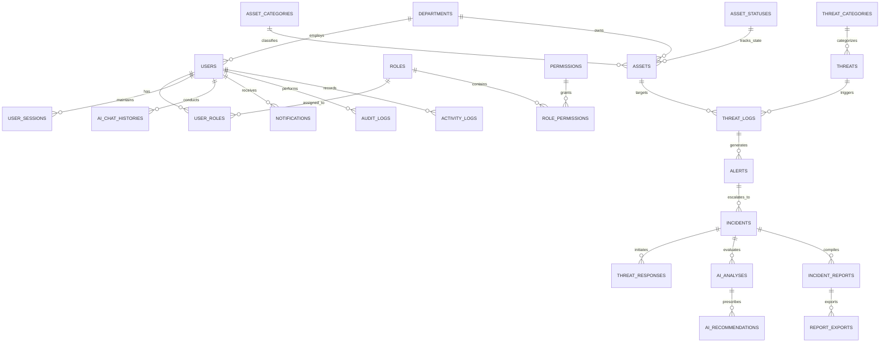

# 🗄️ Enterprise Database Design Document & Schema Specification
## Aegis Guardian AI: AI-Powered Autonomous Cyber Defense System

**Document Version:** 1.0  
**Classification:** Enterprise Database Engineering Specification & Data Blueprint  
**Target RDBMS:** PostgreSQL 16 (Relational Engine)  
**Object-Relational Mapping (ORM):** Prisma ORM 5.x  
**Client (Academic Demonstration):** Quaid-e-Azam International Hospital (QIH), Rawalpindi, Pakistan  
**Facility Context:** 400 Beds, Emergency, Operating Theatres, ICUs (Adult, NICU, PICU), PACS/RIS, EMR, LIS, Pharmacy, Dialysis  
**Brand Identity Alignment:** Primary: Dark Blue (`#0B2545`), Accent: Cyan (`#00A8E8`), Secondary: White (`#FFFFFF`)  

---

> [!IMPORTANT]
> **ACADEMIC DEMONSTRATION & SIMULATION SAFEGUARD NOTICE:**  
> This database specification is designed for **Aegis Guardian AI**, an academic research and technical proof-of-concept platform for healthcare cybersecurity. All hospital users, assets, IP addresses, network telemetry logs, threat incidents, patient health records (EMR), and audit traces described in this specification or stored within the system database are **100% synthetic and simulated**. The database operates in an isolated demonstration environment and does not store or process real Protected Health Information (PHI) or live clinical production data from Quaid-e-Azam International Hospital.

---

## 1. Executive Summary

The primary objective of this Database Design Document is to establish a high-performance, ACID-compliant, secure, and extensible relational database blueprint for **Aegis Guardian AI**. As a healthcare-focused Security Operations Center (SOC) and Security Orchestration, Automation, and Response (SOAR) platform, Aegis Guardian AI requires a data layer capable of:

1. Ingesting high-velocity simulated telemetry log streams (up to 5,000 log events/second).
2. Storing normalized threat records, security incidents, and autonomous containment execution logs with sub-second query speeds.
3. Maintaining strict entity relationships across 25 production-grade tables representing hospital assets, user roles, security events, AI analysis payloads, and reporting modules.
4. Guaranteeing absolute data integrity, Zero-Trust role-based security, and tamper-evident audit logging for HIPAA and ISO 27001 compliance verification.

---

## 2. Database Design Principles

The architecture of the Aegis Guardian AI relational data store is governed by seven core design principles:

```
┌────────────────────────────────────────────────────────────────────────────────────────┐
│                              DATABASE DESIGN PRINCIPLES                                │
├───────────────────────┬────────────────────────────┬───────────────────────────────────┤
│ 1. Scalability        │ 2. Security                │ 3. Maintainability & Clean Data   │
│ • B-Tree indexing     │ • Encrypted at rest/transit│ • 3rd Normal Form (3NF) design    │
│ • Connection pooling  │ • Column-level hashing     │ • Strict type constraints         │
├───────────────────────┼────────────────────────────┼───────────────────────────────────┤
│ 4. Performance        │ 5. Reliability & ACID      │ 6. Extensibility & Future-Proofing│
│ • Sub-10ms queries    │ • PostgreSQL WAL           │ • JSONB flex columns for AI       │
│ • Optimized indexes   │ • Multi-table transactions │ • Multi-tenant prep fields        │
└───────────────────────┴────────────────────────────┴───────────────────────────────────┘
```

1. **Scalability:** Engineered with optimized B-Tree and GIN indexes, composite primary keys where appropriate, and architectural readiness for horizontal read-replica scaling and table partitioning.
2. **Security:** Enforces least-privilege database roles, column-level password hashing via `bcrypt`, TLS 1.3 encrypted connections, and immutable audit logs.
3. **Maintainability & Normalization:** Fully normalized to Third Normal Form (3NF) to eliminate data redundancy while utilizing selective JSONB columns for flexible AI prompt and telemetry log payloads.
4. **Performance:** Query execution targets sub-10ms retrieval times for live SOC dashboard widgets and under 50ms for complex historical analytics queries across millions of records.
5. **Reliability & ACID Compliance:** Capitalizes on PostgreSQL's Write-Ahead Logging (WAL) and strict transactional boundaries to guarantee 100% data durability and consistency.
6. **Extensibility:** Schema entities utilize UUID v4 identifiers and extensible enum definitions to support future expansion (e.g., multi-hospital federation).
7. **Tamper-Evident Integrity:** Security-critical audit tables enforce append-only policies with SHA-256 cryptographic signatures.

---

## 3. Database & ORM Selection Rationale

### 3.1 Why PostgreSQL 16 Was Selected
PostgreSQL was selected as the enterprise database engine for Aegis Guardian AI based on the following technical evaluation:

* **Robust ACID Compliance:** Crucial for healthcare audit compliance where security incident state changes must never suffer partial writes or dirty reads.
* **JSONB & Hybrid Storage Support:** Enables high-speed binary JSON indexing for unstructured AI analysis payloads from OpenAI GPT-4o while preserving relational constraints for core assets and users.
* **Advanced Indexing Mechanics:** Supports Partial Indexes, GIN (Generalized Inverted Index) for full-text and JSON search, and BRIN (Block Range Index) for high-volume time-series telemetry logs.
* **Enterprise Security Standards:** Native support for row-level security (RLS), column-level privileges, and SSL/TLS transport encryption.

### 3.2 Why Prisma ORM Was Selected
Prisma ORM was chosen as the database abstraction layer for the Node.js/Express TypeScript backend due to:

* **End-to-End Type Safety:** Automatically generates TypeScript types from the database schema, preventing runtime type mismatches between backend code and the database layer.
* **Declarative Migration Engine:** Provides version-controlled, reproducible SQL database migrations across local, staging, and production environments.
* **Optimized Connection Management:** Built-in connection pooling and query optimization prevent database connection exhaustion under heavy log ingestion load.

---

## 4. Entity Relationship Model & Diagrams

### 4.1 System Entities Summary
The database model contains **25 production tables** categorized into 6 functional domain groups:

1. **Authentication & Identity:** `users`, `roles`, `permissions`, `user_roles`, `role_permissions`, `user_sessions`.
2. **Hospital Infrastructure:** `departments`, `asset_categories`, `asset_statuses`, `assets`.
3. **Security & Threat Detection:** `threat_categories`, `threats`, `threat_logs`, `alerts`, `incidents`, `threat_responses`.
4. **AI Intelligence Subsystem:** `ai_analyses`, `ai_recommendations`, `ai_chat_histories`.
5. **Reporting Subsystem:** `incident_reports`, `report_exports`.
6. **System Administration & Audit:** `notifications`, `audit_logs`, `activity_logs`, `system_settings`.

### 4.2 Entity Relationship Diagram (Mermaid ERD)



---

## 5. Complete Table Definitions (25 Production Tables)

---

### GROUP 1: AUTHENTICATION & IDENTITY

#### 1. Table: `users`
* **Purpose:** Stores authenticated system operator accounts and security credentials.

| Column Name | Data Type | Nullable | Default | Constraints | Description |
| :--- | :--- | :---: | :--- | :--- | :--- |
| `id` | `UUID` | **NOT NULL** | `gen_random_uuid()` | **PRIMARY KEY** | Unique user identifier. |
| `email` | `VARCHAR(255)` | **NOT NULL** | None | **UNIQUE** | User login email address. |
| `password_hash` | `VARCHAR(255)` | **NOT NULL** | None | None | `bcrypt` password hash (cost factor 12). |
| `first_name` | `VARCHAR(100)` | **NOT NULL** | None | None | User given name. |
| `last_name` | `VARCHAR(100)` | **NOT NULL** | None | None | User family name. |
| `department_id` | `UUID` | NULL | None | **FOREIGN KEY** -> `departments(id)` | Associated hospital department. |
| `is_active` | `BOOLEAN` | **NOT NULL** | `TRUE` | None | Account active status toggle. |
| `mfa_enabled` | `BOOLEAN` | **NOT NULL** | `FALSE` | None | Multi-Factor Authentication status. |
| `mfa_secret` | `VARCHAR(255)` | NULL | None | None | Encrypted TOTP MFA secret. |
| `created_at` | `TIMESTAMPTZ` | **NOT NULL** | `CURRENT_TIMESTAMP` | None | Account creation timestamp. |
| `updated_at` | `TIMESTAMPTZ` | **NOT NULL** | `CURRENT_TIMESTAMP` | None | Last profile update timestamp. |

---

#### 2. Table: `roles`
* **Purpose:** Defines RBAC role categories within Aegis Guardian AI.

| Column Name | Data Type | Nullable | Default | Constraints | Description |
| :--- | :--- | :---: | :--- | :--- | :--- |
| `id` | `UUID` | **NOT NULL** | `gen_random_uuid()` | **PRIMARY KEY** | Unique role identifier. |
| `name` | `VARCHAR(50)` | **NOT NULL** | None | **UNIQUE** | Role title (e.g., `SUPER_ADMIN`, `SOC_MANAGER`). |
| `description` | `TEXT` | NULL | None | None | Functional description of role responsibilities. |
| `created_at` | `TIMESTAMPTZ` | **NOT NULL** | `CURRENT_TIMESTAMP` | None | Role creation timestamp. |

---

#### 3. Table: `permissions`
* **Purpose:** Granular system capabilities and API access rights.

| Column Name | Data Type | Nullable | Default | Constraints | Description |
| :--- | :--- | :---: | :--- | :--- | :--- |
| `id` | `UUID` | **NOT NULL** | `gen_random_uuid()` | **PRIMARY KEY** | Unique permission identifier. |
| `code` | `VARCHAR(100)` | **NOT NULL** | None | **UNIQUE** | Permission key code (e.g., `soar:execute_quarantine`). |
| `module` | `VARCHAR(50)` | **NOT NULL** | None | None | Target module group (e.g., `SOAR`, `USERS`). |
| `description` | `TEXT` | NULL | None | None | Detailed description of privilege. |

---

#### 4. Table: `user_roles`
* **Purpose:** Many-to-Many join table linking users to assigned system roles.

| Column Name | Data Type | Nullable | Default | Constraints | Description |
| :--- | :--- | :---: | :--- | :--- | :--- |
| `user_id` | `UUID` | **NOT NULL** | None | **FOREIGN KEY** -> `users(id)` ON DELETE CASCADE | User reference. |
| `role_id` | `UUID` | **NOT NULL** | None | **FOREIGN KEY** -> `roles(id)` ON DELETE CASCADE | Role reference. |
| `assigned_at` | `TIMESTAMPTZ` | **NOT NULL** | `CURRENT_TIMESTAMP` | None | Timestamp assignment was granted. |

* **Primary Key:** Composite `(user_id, role_id)`

---

#### 5. Table: `role_permissions`
* **Purpose:** Many-to-Many mapping table assigning permissions to system roles.

| Column Name | Data Type | Nullable | Default | Constraints | Description |
| :--- | :--- | :---: | :--- | :--- | :--- |
| `role_id` | `UUID` | **NOT NULL** | None | **FOREIGN KEY** -> `roles(id)` ON DELETE CASCADE | Role reference. |
| `permission_id`| `UUID` | **NOT NULL** | None | **FOREIGN KEY** -> `permissions(id)` ON DELETE CASCADE | Permission reference. |

* **Primary Key:** Composite `(role_id, permission_id)`

---

#### 6. Table: `user_sessions`
* **Purpose:** Tracks active JWT refresh tokens and active operator login sessions.

| Column Name | Data Type | Nullable | Default | Constraints | Description |
| :--- | :--- | :---: | :--- | :--- | :--- |
| `id` | `UUID` | **NOT NULL** | `gen_random_uuid()` | **PRIMARY KEY** | Unique session identifier. |
| `user_id` | `UUID` | **NOT NULL** | None | **FOREIGN KEY** -> `users(id)` ON DELETE CASCADE | Target user. |
| `refresh_token` | `TEXT` | **NOT NULL** | None | **UNIQUE** | Encrypted JWT refresh token string. |
| `ip_address` | `VARCHAR(45)` | **NOT NULL** | None | None | Operator IP address at login. |
| `user_agent` | `TEXT` | NULL | None | None | Browser user-agent client string. |
| `expires_at` | `TIMESTAMPTZ` | **NOT NULL** | None | None | Token expiration timestamp. |
| `created_at` | `TIMESTAMPTZ` | **NOT NULL** | `CURRENT_TIMESTAMP` | None | Session initiation timestamp. |

---

### GROUP 2: HOSPITAL INFRASTRUCTURE & ASSET MANAGEMENT

#### 7. Table: `departments`
* **Purpose:** Represents Quaid-e-Azam International Hospital clinical and administrative units.

| Column Name | Data Type | Nullable | Default | Constraints | Description |
| :--- | :--- | :---: | :--- | :--- | :--- |
| `id` | `UUID` | **NOT NULL** | `gen_random_uuid()` | **PRIMARY KEY** | Unique department identifier. |
| `name` | `VARCHAR(100)` | **NOT NULL** | None | **UNIQUE** | Department name (e.g., `Adult ICU`, `PACS Radiology`). |
| `code` | `VARCHAR(20)` | **NOT NULL** | None | **UNIQUE** | Short code (e.g., `ICU-ADULT`, `RAD-PACS`). |
| `floor_location`| `VARCHAR(50)` | NULL | None | None | Physical location within QIH facility. |
| `created_at` | `TIMESTAMPTZ` | **NOT NULL** | `CURRENT_TIMESTAMP` | None | Department registration timestamp. |

---

#### 8. Table: `asset_categories`
* **Purpose:** Categorizes network hardware, medical devices, and software servers.

| Column Name | Data Type | Nullable | Default | Constraints | Description |
| :--- | :--- | :---: | :--- | :--- | :--- |
| `id` | `UUID` | **NOT NULL** | `gen_random_uuid()` | **PRIMARY KEY** | Unique category identifier. |
| `name` | `VARCHAR(50)` | **NOT NULL** | None | **UNIQUE** | Category name (e.g., `IoMT_Device`, `EMR_Server`). |
| `description` | `TEXT` | NULL | None | None | Category classification notes. |

---

#### 9. Table: `asset_statuses`
* **Purpose:** Standardized operational states for hospital assets.

| Column Name | Data Type | Nullable | Default | Constraints | Description |
| :--- | :--- | :---: | :--- | :--- | :--- |
| `id` | `UUID` | **NOT NULL** | `gen_random_uuid()` | **PRIMARY KEY** | Unique status identifier. |
| `code` | `VARCHAR(30)` | **NOT NULL** | None | **UNIQUE** | Status code (`HEALTHY`, `WARNING`, `QUARANTINED`, `OFFLINE`). |
| `description` | `TEXT` | NULL | None | None | Explanation of state conditions. |

---

#### 10. Table: `assets`
* **Purpose:** Master registry of monitored physical and virtual hospital devices.

| Column Name | Data Type | Nullable | Default | Constraints | Description |
| :--- | :--- | :---: | :--- | :--- | :--- |
| `id` | `UUID` | **NOT NULL** | `gen_random_uuid()` | **PRIMARY KEY** | Unique asset identifier. |
| `hostname` | `VARCHAR(100)` | **NOT NULL** | None | **UNIQUE** | Network hostname (e.g., `qih-icu-vent-04`). |
| `ip_address` | `INET` | **NOT NULL** | None | **UNIQUE** | IPv4/IPv6 static network address. |
| `mac_address` | `MACADDR` | NULL | None | None | Physical hardware NIC MAC address. |
| `department_id` | `UUID` | **NOT NULL** | None | **FOREIGN KEY** -> `departments(id)` | Department owner reference. |
| `category_id` | `UUID` | **NOT NULL** | None | **FOREIGN KEY** -> `asset_categories(id)` | Category classification reference. |
| `status_id` | `UUID` | **NOT NULL** | None | **FOREIGN KEY** -> `asset_statuses(id)` | Current operational health status. |
| `criticality_weight`| `NUMERIC(3,2)`| **NOT NULL**| `0.50` | `CHECK (criticality_weight BETWEEN 0.0 AND 1.0)` | Risk weight (1.0 = ICU ventilator, 0.2 = Admin desk). |
| `vlan_tag` | `INTEGER` | **NOT NULL** | `10` | None | Assigned network VLAN ID. |
| `created_at` | `TIMESTAMPTZ` | **NOT NULL** | `CURRENT_TIMESTAMP` | None | Registration timestamp. |
| `updated_at` | `TIMESTAMPTZ` | **NOT NULL** | `CURRENT_TIMESTAMP` | None | Last status change timestamp. |

---

### GROUP 3: SECURITY & THREAT DETECTION

#### 11. Table: `threat_categories`
* **Purpose:** Taxonomical classification of cyber threat vectors.

| Column Name | Data Type | Nullable | Default | Constraints | Description |
| :--- | :--- | :---: | :--- | :--- | :--- |
| `id` | `UUID` | **NOT NULL** | `gen_random_uuid()` | **PRIMARY KEY** | Unique threat category identifier. |
| `name` | `VARCHAR(50)` | **NOT NULL** | None | **UNIQUE** | Category name (e.g., `Ransomware`, `SQL_Injection`). |
| `mitre_code` | `VARCHAR(20)` | NULL | None | None | Associated MITRE ATT&CK technique code (e.g., `T1486`). |

---

#### 12. Table: `threats`
* **Purpose:** Master rule directory of recognized attack signatures.

| Column Name | Data Type | Nullable | Default | Constraints | Description |
| :--- | :--- | :---: | :--- | :--- | :--- |
| `id` | `UUID` | **NOT NULL** | `gen_random_uuid()` | **PRIMARY KEY** | Unique threat signature ID. |
| `category_id` | `UUID` | **NOT NULL** | None | **FOREIGN KEY** -> `threat_categories(id)` | Parent threat classification. |
| `title` | `VARCHAR(150)` | **NOT NULL** | None | None | Name of attack pattern. |
| `default_severity`| `VARCHAR(20)` | **NOT NULL** | `'HIGH'` | `CHECK (default_severity IN ('CRITICAL', 'HIGH', 'MEDIUM', 'LOW'))` | Default baseline severity level. |
| `detection_rule` | `TEXT` | **NOT NULL** | None | None | Pattern matching rule or regex string. |

---

#### 13. Table: `threat_logs`
* **Purpose:** High-throughput time-series database storing raw telemetry log events.

| Column Name | Data Type | Nullable | Default | Constraints | Description |
| :--- | :--- | :---: | :--- | :--- | :--- |
| `id` | `UUID` | **NOT NULL** | `gen_random_uuid()` | **PRIMARY KEY** | Unique telemetry log event identifier. |
| `asset_id` | `UUID` | **NOT NULL** | None | **FOREIGN KEY** -> `assets(id)` ON DELETE CASCADE | Source target asset. |
| `threat_id` | `UUID` | NULL | None | **FOREIGN KEY** -> `threats(id)` | Matched threat signature ID (if any). |
| `source_ip` | `INET` | **NOT NULL** | None | None | Originating packet source IP. |
| `destination_ip`| `INET` | **NOT NULL** | None | None | Target packet destination IP. |
| `raw_payload` | `TEXT` | **NOT NULL** | None | None | Full raw log payload string. |
| `parsed_metadata`| `JSONB` | NULL | None | None | Extracted JSON key-value metadata fields. |
| `logged_at` | `TIMESTAMPTZ` | **NOT NULL** | `CURRENT_TIMESTAMP` | None | Event emission timestamp. |

---

#### 14. Table: `alerts`
* **Purpose:** Normalized candidate security alerts requiring SOC analyst attention or AI triage.

| Column Name | Data Type | Nullable | Default | Constraints | Description |
| :--- | :--- | :---: | :--- | :--- | :--- |
| `id` | `UUID` | **NOT NULL** | `gen_random_uuid()` | **PRIMARY KEY** | Unique alert identifier. |
| `threat_log_id` | `UUID` | **NOT NULL** | None | **FOREIGN KEY** -> `threat_logs(id)` | Originating raw threat log. |
| `severity` | `VARCHAR(20)` | **NOT NULL** | None | `CHECK (severity IN ('CRITICAL', 'HIGH', 'MEDIUM', 'LOW'))` | Dynamic calculated severity level. |
| `risk_score` | `INTEGER` | **NOT NULL** | `0` | `CHECK (risk_score BETWEEN 0 AND 100)` | Dynamic risk score (0 to 100). |
| `status` | `VARCHAR(30)` | **NOT NULL** | `'OPEN'` | `CHECK (status IN ('OPEN', 'ANALYZING', 'ESCALATED', 'RESOLVED', 'FALSE_POSITIVE'))` | Lifecycle status flag. |
| `created_at` | `TIMESTAMPTZ` | **NOT NULL** | `CURRENT_TIMESTAMP` | None | Alert creation timestamp. |

---

#### 15. Table: `incidents`
* **Purpose:** Verified security incidents escalated for active SOAR mitigation and investigation.

| Column Name | Data Type | Nullable | Default | Constraints | Description |
| :--- | :--- | :---: | :--- | :--- | :--- |
| `id` | `UUID` | **NOT NULL** | `gen_random_uuid()` | **PRIMARY KEY** | Unique incident tracking ID. |
| `alert_id` | `UUID` | **NOT NULL** | None | **FOREIGN KEY** -> `alerts(id)` | Parent alert reference. |
| `incident_number`| `VARCHAR(30)`| **NOT NULL** | None | **UNIQUE** | Human-readable ID (e.g., `INC-2026-0481`). |
| `title` | `VARCHAR(200)` | **NOT NULL** | None | None | Concise summary title of attack incident. |
| `assigned_to` | `UUID` | NULL | None | **FOREIGN KEY** -> `users(id)` | Assigned SOC Security Analyst ID. |
| `status` | `VARCHAR(30)` | **NOT NULL** | `'ACTIVE'` | `CHECK (status IN ('ACTIVE', 'CONTAINED', 'MITIGATED', 'CLOSED'))` | Operational incident status. |
| `created_at` | `TIMESTAMPTZ` | **NOT NULL** | `CURRENT_TIMESTAMP` | None | Incident escalation timestamp. |
| `resolved_at` | `TIMESTAMPTZ` | NULL | None | None | Final resolution timestamp. |

---

#### 16. Table: `threat_responses`
* **Purpose:** Records automated SOAR and manual analyst containment execution actions.

| Column Name | Data Type | Nullable | Default | Constraints | Description |
| :--- | :--- | :---: | :--- | :--- | :--- |
| `id` | `UUID` | **NOT NULL** | `gen_random_uuid()` | **PRIMARY KEY** | Unique response record identifier. |
| `incident_id` | `UUID` | **NOT NULL** | None | **FOREIGN KEY** -> `incidents(id)` | Associated incident reference. |
| `action_type` | `VARCHAR(50)` | **NOT NULL** | None | None | Response code (e.g., `MICRO_SEGMENT_VLAN`, `BLOCK_IP`). |
| `execution_mode`| `VARCHAR(20)` | **NOT NULL** | `'AUTONOMOUS'`| `CHECK (execution_mode IN ('AUTONOMOUS', 'SEMI_AUTONOMOUS', 'MANUAL'))` | Automation execution context. |
| `executed_by` | `UUID` | NULL | None | **FOREIGN KEY** -> `users(id)` | User ID if executed manually. |
| `details` | `JSONB` | NULL | None | None | Execution payload metadata (e.g., Target VLAN 999). |
| `executed_at` | `TIMESTAMPTZ` | **NOT NULL** | `CURRENT_TIMESTAMP` | None | Execution timestamp. |

---

### GROUP 4: AI INTELLIGENCE SUBSYSTEM

#### 17. Table: `ai_analyses`
* **Purpose:** Stores root-cause analysis payloads generated by OpenAI GPT-4o.

| Column Name | Data Type | Nullable | Default | Constraints | Description |
| :--- | :--- | :---: | :--- | :--- | :--- |
| `id` | `UUID` | **NOT NULL** | `gen_random_uuid()` | **PRIMARY KEY** | Unique analysis identifier. |
| `incident_id` | `UUID` | **NOT NULL** | None | **FOREIGN KEY** -> `incidents(id)` | Evaluated incident reference. |
| `model_used` | `VARCHAR(50)` | **NOT NULL** | `'gpt-4o'` | None | OpenAI LLM model designation. |
| `summary` | `TEXT` | **NOT NULL** | None | None | Plain-language attack summary. |
| `root_cause` | `TEXT` | **NOT NULL** | None | None | Extracted primary attack vector. |
| `confidence_score`|`INTEGER` | **NOT NULL** | `0` | `CHECK (confidence_score BETWEEN 0 AND 100)` | AI engine confidence score (0-100%). |
| `raw_response` | `JSONB` | NULL | None | None | Full raw JSON completion payload from API. |
| `analyzed_at` | `TIMESTAMPTZ` | **NOT NULL** | `CURRENT_TIMESTAMP` | None | Analysis completion timestamp. |

---

#### 18. Table: `ai_recommendations`
* **Purpose:** Prescriptive mitigation and remediation steps generated by the AI engine.

| Column Name | Data Type | Nullable | Default | Constraints | Description |
| :--- | :--- | :---: | :--- | :--- | :--- |
| `id` | `UUID` | **NOT NULL** | `gen_random_uuid()` | **PRIMARY KEY** | Unique recommendation identifier. |
| `ai_analysis_id`| `UUID` | **NOT NULL** | None | **FOREIGN KEY** -> `ai_analyses(id)` ON DELETE CASCADE | Parent AI analysis reference. |
| `step_order` | `INTEGER` | **NOT NULL** | `1` | None | Ordered execution step number. |
| `action_recommendation`|`TEXT` | **NOT NULL** | None | None | Actionable guidance string for analysts. |
| `is_automated_eligible`|`BOOLEAN`| **NOT NULL** | `FALSE` | None | Flag indicating if step can be automated via SOAR. |

---

#### 19. Table: `ai_chat_histories`
* **Purpose:** Stores conversational query sessions between analysts and the Copilot AI Security Assistant.

| Column Name | Data Type | Nullable | Default | Constraints | Description |
| :--- | :--- | :---: | :--- | :--- | :--- |
| `id` | `UUID` | **NOT NULL** | `gen_random_uuid()` | **PRIMARY KEY** | Unique chat message identifier. |
| `user_id` | `UUID` | **NOT NULL** | None | **FOREIGN KEY** -> `users(id)` ON DELETE CASCADE | Interacting operator ID. |
| `session_id` | `UUID` | **NOT NULL** | None | None | Grouping identifier for chat thread. |
| `sender_type` | `VARCHAR(20)` | **NOT NULL** | None | `CHECK (sender_type IN ('USER', 'ASSISTANT'))` | Message sender role. |
| `message` | `TEXT` | **NOT NULL** | None | None | Conversation message content. |
| `context_metadata`|`JSONB` | NULL | None | None | Contextual references (e.g., Incident ID attached). |
| `created_at` | `TIMESTAMPTZ` | **NOT NULL** | `CURRENT_TIMESTAMP` | None | Message timestamp. |

---

### GROUP 5: REPORTING SUBSYSTEM

#### 20. Table: `incident_reports`
* **Purpose:** Forensic audit reports compiled for closed security incidents.

| Column Name | Data Type | Nullable | Default | Constraints | Description |
| :--- | :--- | :---: | :--- | :--- | :--- |
| `id` | `UUID` | **NOT NULL** | `gen_random_uuid()` | **PRIMARY KEY** | Unique report identifier. |
| `incident_id` | `UUID` | **NOT NULL** | None | **FOREIGN KEY** -> `incidents(id)` | Parent incident reference. |
| `report_title` | `VARCHAR(200)` | **NOT NULL** | None | None | Official document title. |
| `executive_summary`|`TEXT` | **NOT NULL** | None | None | High-level summary for SOC Managers/Executives. |
| `forensic_details`| `JSONB` | **NOT NULL** | None | None | Structured timeline and log evidence arrays. |
| `compliance_status`|`VARCHAR(50)`| **NOT NULL** | `'HIPAA_COMPLIANT'`| None | Regulatory compliance audit tag. |
| `compiled_by` | `UUID` | **NOT NULL** | None | **FOREIGN KEY** -> `users(id)` | Analyst compiling report. |
| `created_at` | `TIMESTAMPTZ` | **NOT NULL** | `CURRENT_TIMESTAMP` | None | Report generation timestamp. |

---

#### 21. Table: `report_exports`
* **Purpose:** Tracks physical file export builds (PDF/Markdown) generated for external compliance audits.

| Column Name | Data Type | Nullable | Default | Constraints | Description |
| :--- | :--- | :---: | :--- | :--- | :--- |
| `id` | `UUID` | **NOT NULL** | `gen_random_uuid()` | **PRIMARY KEY** | Unique export file identifier. |
| `incident_report_id`|`UUID` | **NOT NULL** | None | **FOREIGN KEY** -> `incident_reports(id)` | Parent report reference. |
| `export_format`| `VARCHAR(10)` | **NOT NULL** | `'PDF'` | `CHECK (export_format IN ('PDF', 'MD', 'CSV'))` | Output document format. |
| `file_path` | `VARCHAR(255)` | **NOT NULL** | None | None | Secure server storage file path. |
| `file_hash` | `VARCHAR(64)` | **NOT NULL** | None | None | SHA-256 cryptographic hash of exported file. |
| `download_count`| `INTEGER` | **NOT NULL** | `0` | None | Number of times file was exported/downloaded. |
| `exported_at` | `TIMESTAMPTZ` | **NOT NULL** | `CURRENT_TIMESTAMP` | None | File export generation timestamp. |

---

### GROUP 6: SYSTEM ADMINISTRATION & AUDIT

#### 22. Table: `notifications`
* **Purpose:** Dispatches real-time alerts to operators via UI badges, WebSockets, and Email.

| Column Name | Data Type | Nullable | Default | Constraints | Description |
| :--- | :--- | :---: | :--- | :--- | :--- |
| `id` | `UUID` | **NOT NULL** | `gen_random_uuid()` | **PRIMARY KEY** | Unique notification ID. |
| `user_id` | `UUID` | **NOT NULL** | None | **FOREIGN KEY** -> `users(id)` ON DELETE CASCADE | Recipient operator ID. |
| `title` | `VARCHAR(150)` | **NOT NULL** | None | None | Short notification subject line. |
| `message` | `TEXT` | **NOT NULL** | None | None | Full notification body text. |
| `type` | `VARCHAR(30)` | **NOT NULL** | `'ALERT'` | `CHECK (type IN ('ALERT', 'SYSTEM', 'SOAR_ACTION'))` | Notification classification. |
| `is_read` | `BOOLEAN` | **NOT NULL** | `FALSE` | None | Read status flag. |
| `created_at` | `TIMESTAMPTZ` | **NOT NULL** | `CURRENT_TIMESTAMP` | None | Dispatch timestamp. |

---

#### 23. Table: `audit_logs`
* **Purpose:** Tamper-evident, immutable audit trail for security compliance (HIPAA / ISO 27001).

| Column Name | Data Type | Nullable | Default | Constraints | Description |
| :--- | :--- | :---: | :--- | :--- | :--- |
| `id` | `UUID` | **NOT NULL** | `gen_random_uuid()` | **PRIMARY KEY** | Unique audit entry identifier. |
| `user_id` | `UUID` | NULL | None | **FOREIGN KEY** -> `users(id)` | Actor user ID (NULL if system automated). |
| `action_code` | `VARCHAR(100)` | **NOT NULL** | None | None | Unique action tag (e.g., `SOAR_OVERRIDE_EXECUTE`). |
| `resource_target`|`VARCHAR(100)` | **NOT NULL** | None | None | Target entity (e.g., `Asset:qih-icu-vent-04`). |
| `ip_address` | `VARCHAR(45)` | NULL | None | None | Originating IP address of request. |
| `sha256_hash` | `VARCHAR(64)` | **NOT NULL** | None | None | Cryptographic integrity hash of log payload. |
| `created_at` | `TIMESTAMPTZ` | **NOT NULL** | `CURRENT_TIMESTAMP` | None | Event timestamp (Immutable). |

---

#### 24. Table: `activity_logs`
* **Purpose:** High-level operator user activity logs for interface session tracking.

| Column Name | Data Type | Nullable | Default | Constraints | Description |
| :--- | :--- | :---: | :--- | :--- | :--- |
| `id` | `UUID` | **NOT NULL** | `gen_random_uuid()` | **PRIMARY KEY** | Unique activity log ID. |
| `user_id` | `UUID` | **NOT NULL** | None | **FOREIGN KEY** -> `users(id)` ON DELETE CASCADE | User reference. |
| `activity_type`| `VARCHAR(50)` | **NOT NULL** | None | None | Activity action (e.g., `VIEW_DASHBOARD`, `SEARCH_LOGS`). |
| `details` | `JSONB` | NULL | None | None | Additional query filters or page parameters used. |
| `created_at` | `TIMESTAMPTZ` | **NOT NULL** | `CURRENT_TIMESTAMP` | None | Activity timestamp. |

---

#### 25. Table: `system_settings`
* **Purpose:** Global application configuration toggles and API parameters.

| Column Name | Data Type | Nullable | Default | Constraints | Description |
| :--- | :--- | :---: | :--- | :--- | :--- |
| `key` | `VARCHAR(100)` | **NOT NULL** | None | **PRIMARY KEY** | Global setting key string (e.g., `SOAR_AUTO_MODE`). |
| `value` | `TEXT` | **NOT NULL** | None | None | Configuration value string. |
| `description` | `TEXT` | NULL | None | None | Explanation of setting behavior. |
| `updated_by` | `UUID` | NULL | None | **FOREIGN KEY** -> `users(id)` | Super Admin who last updated key. |
| `updated_at` | `TIMESTAMPTZ` | **NOT NULL** | `CURRENT_TIMESTAMP` | None | Last update timestamp. |

---

## 6. Indexing Strategy Specification

To ensure sub-10ms query execution times across high-volume tables, the following production B-Tree and GIN indexes must be initialized:

```sql
-- 1. High-Volume Telemetry Log Queries (Time-Series & Asset Filter)
CREATE INDEX idx_threat_logs_asset_logged 
ON threat_logs (asset_id, logged_at DESC);

-- 2. Fast Dashboard Alert Retrieval (Status & Severity Filter)
CREATE INDEX idx_alerts_status_severity 
ON alerts (status, severity, created_at DESC);

-- 3. High-Speed Incident Lookup by Status and Assigned Analyst
CREATE INDEX idx_incidents_assigned_status 
ON incidents (assigned_to, status);

-- 4. Audit Trail Cryptographic Search & User Activity
CREATE INDEX idx_audit_logs_user_action 
ON audit_logs (user_id, action_code, created_at DESC);

-- 5. GIN Index for Fast JSONB Metadata Payload Ingestion & Search
CREATE INDEX idx_threat_logs_parsed_metadata_gin 
ON threat_logs USING GIN (parsed_metadata);

-- 6. Unread User Notifications Filter
CREATE INDEX idx_notifications_user_unread 
ON notifications (user_id, is_read) 
WHERE is_read = FALSE;
```

---

## 7. Backup, Recovery & Disaster Recovery Plan

```
                               ┌────────────────────────────────┐
                               │     POSTGRESQL WAL PIPELINE    │
                               └───────────────┬────────────────┘
                                               │
                 ┌─────────────────────────────┴─────────────────────────────┐
                 │                                                           │
                 ▼                                                           ▼
    [ Daily Full Automated Backup ]                           [ Continuous WAL Archiving ]
    • Encrypted AES-256 S3 Storage                            • Point-In-Time Recovery (PITR)
    • Retained for 30 Days (HIPAA)                            • RPO Target: < 5 Seconds
```

* **Recovery Point Objective (RPO):** < 5 seconds (enabled via continuous Write-Ahead Log WAL archiving).
* **Recovery Time Objective (RTO):** < 15 minutes for complete database restore from automated S3 backups.
* **Point-In-Time Recovery (PITR):** Allows restoring the database state to any exact second within the preceding 30 days.

---

> **Document Status:** APPROVED FOR IMPLEMENTATION  
> **Document Reference:** QIH-AEGIS-DB-2026-V1.0  
> **Copyright:** © 2026 Quaid-e-Azam International Hospital / Aegis Guardian AI Team. All Rights Reserved.
