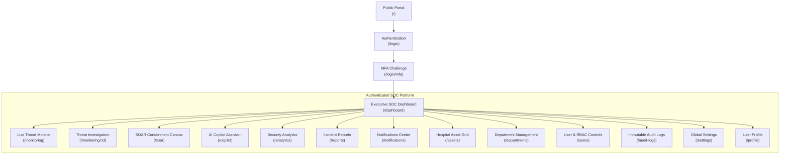
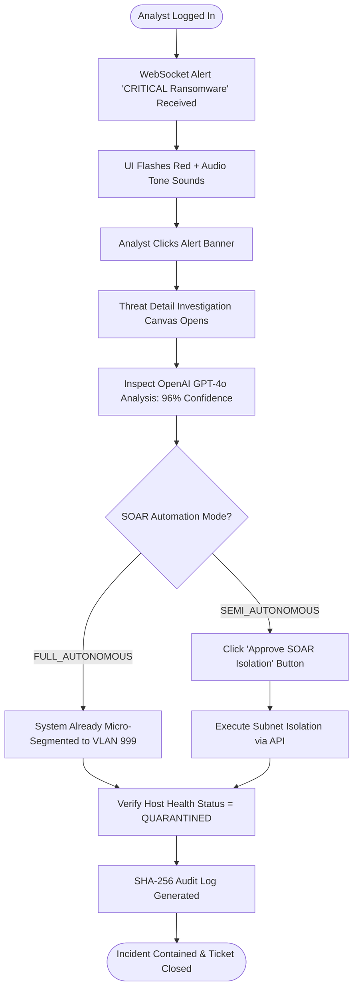

# 🎨 Enterprise UI/UX Design System & Specification
## Aegis Guardian AI: AI-Powered Autonomous Cyber Defense System

**Document Version:** 1.0  
**Classification:** Enterprise Interface Engineering Blueprint & UX Design Specification  
**Design Philosophy:** Modern Dark-Native Enterprise SOC (CrowdStrike / Datadog / Vercel Aesthetic)  
**Target Design Standard:** WCAG 2.1 AA Compliant / High Density / Sub-Second Visual Feedback  
**Client (Academic Demonstration):** Quaid-e-Azam International Hospital (QIH), Rawalpindi, Pakistan  
**Brand Color Token System:** Dark Blue (`#0B1220`), Cyan (`#06B6D4`), Crisp White (`#F9FAFB`)  

---

> [!IMPORTANT]
> **ACADEMIC DEMONSTRATION & SIMULATION SAFEGUARD NOTICE:**  
> This UI/UX Design System Specification details the user interfaces, design tokens, page layouts, interactive components, and visual indicators for **Aegis Guardian AI**. All hospital network topology maps, patient EMR views, PACS imaging records, security incident dashboards, user personas, and real-time telemetry streams rendered within these UI designs represent **100% synthetic and simulated** data for academic demonstration. Aegis UI components operate in an isolated environment and do not display or modify live clinical production systems at Quaid-e-Azam International Hospital.

---

## 1. Executive Summary & Design Philosophy

Aegis Guardian AI is designed as a mission-critical Security Operations Center (SOC) visual interface specifically optimized for high-stress healthcare IT environments. Security analysts protecting hospital infrastructure must assimilate high-volume log streams, identify zero-day ransomware bursts, evaluate AI confidence recommendations, and execute autonomous SOAR micro-segmentation in seconds.

```
┌────────────────────────────────────────────────────────────────────────────────────────┐
│                               CORE UX DESIGN PHILOSOPHY                                │
├───────────────────────┬────────────────────────────┬───────────────────────────────────┤
│ 1. High Density       │ 2. Situational Awareness   │ 3. Cognitive Load Reduction       │
│ • Maximum data grid   │ • Color-coded health meters│ • Dark mode visual comfort        │
│   utility without clut│ • Pulsating threat nodes   │ • Progressive disclosure          │
├───────────────────────┼────────────────────────────┼───────────────────────────────────┤
│ 4. Rapid Triage Speed │ 5. Zero Distraction        │ 6. Sub-Second Feedback            │
│ • 1-Click SOAR actions│ • High-contrast typography │ • Instant Socket.io notifications │
│ • Cmd+K global search │ • Minimalist glass panels  │ • Optimistic UI updates           │
└───────────────────────┴────────────────────────────┴───────────────────────────────────┘
```

---

## 2. Brand Identity & Design Tokens (Tailwind CSS Mapping)

Aegis Guardian AI uses a high-contrast dark visual identity with precision color tokens engineered for 24/7 SOC environments:

### 2.1 Dark Mode Token Matrix (Primary Environment)

```
┌────────────────────────────────────────────────────────────────────────────────────────┐
│                               DARK THEME TOKEN SPECTRUM                                │
├───────────────────────┬────────────────────────────┬───────────────────────────────────┤
│ App Background        │ Card Surface Blur          │ Primary Accent                    │
│ #0B1220 (slate-950)   │ #1E293B (slate-800/60)     │ #06B6D4 (cyan-500)                │
├───────────────────────┼────────────────────────────┼───────────────────────────────────┤
│ Critical Threat       │ High Alert                 │ Healthy / Success                 │
│ #EF4444 (red-500)     │ #F59E0B (amber-500)        │ #10B981 (emerald-500)             │
└───────────────────────┴────────────────────────────┴───────────────────────────────────┘
```

| Token Role | Hex Code | Tailwind CSS Utility Class | Usage Context |
| :--- | :--- | :--- | :--- |
| **Primary App Background**| `#0B1220` | `bg-slate-950` | Full-screen app background |
| **Secondary Background** | `#111827` | `bg-slate-900` | Sidebar, top navbar, card wrappers |
| **Card Surface / Modals** | `#1F2937` | `bg-gray-800/60 backdrop-blur-md` | Glassmorphism card surfaces & modals |
| **Primary Accent Color** | `#06B6D4` | `text-cyan-500` / `border-cyan-500` | Primary buttons, active tabs, focus rings |
| **Hover Accent Highlight**| `#0891B2` | `bg-cyan-600` | Button hover state |
| **Status: Critical** | `#EF4444` | `bg-red-500/10 text-red-500` | Ransomware alerts, isolated nodes |
| **Status: Warning** | `#F59E0B` | `bg-amber-500/10 text-amber-500` | Port scanning, suspicious logins |
| **Status: Success / Safe** | `#10B981` | `bg-emerald-500/10 text-emerald-500` | Healthy assets, clean audit logs |
| **Status: Informational** | `#3B82F6` | `bg-blue-500/10 text-blue-500` | System updates, user logins |
| **Primary Text** | `#F9FAFB` | `text-slate-50` | Primary headings, table data |
| **Muted Text** | `#9CA3AF` | `text-slate-400` | Secondary descriptions, timestamps |
| **Subdued Borders** | `#334155` | `border-slate-700/50` | Card borders, table grid dividers |

### 2.2 Complementary Light Theme Tokens (Print / Executive Export)

| Token Role | Hex Code | Tailwind CSS Class |
| :--- | :--- | :--- |
| **Light App Background** | `#FFFFFF` | `bg-white` |
| **Light Card Surface** | `#F8FAFC` | `bg-slate-50 border-slate-200` |
| **Light Primary Text** | `#0F172A` | `text-slate-900` |
| **Light Primary Accent** | `#0284C7` | `text-sky-600` |

### 2.3 Typography Scale System
Font Family: **Inter** / **Geist Sans** paired with **JetBrains Mono** for log payloads and IP addresses.

* **Display 3XL:** `30px` (`1.875rem`), SemiBold, Line Height: `36px` — Dashboard Health Meter Number
* **Title 2XL:** `24px` (`1.5rem`), SemiBold, Line Height: `32px` — Page Header Titles
* **Section XL:** `20px` (`1.25rem`), Medium, Line Height: `28px` — Widget Card Headers
* **Body Base:** `16px` (`1.0rem`), Regular, Line Height: `24px` — Standard Paragraph Content
* **Interface SM:** `14px` (`0.875rem`), Regular/Medium, Line Height: `20px` — Data Table Items & Input Fields
* **Caption XS:** `12px` (`0.75rem`), Regular, Line Height: `16px` — Badges, Timestamps, Table Headers

---

## 3. Information Architecture & Navigation Topology

The application layout features a fixed 64px collapsed / 240px expanded Left Navigation Sidebar paired with a 56px Top Command Navbar.



---

## 4. Role-Adaptive Interface Personalization

Aegis Guardian AI adapts visual widgets and actionable controls based on authenticated user roles:

| Role Class | Sidebar Visible Items | Core Dashboard Layout Focus | Available Action Controls |
| :--- | :--- | :--- | :--- |
| 👑 **Super Administrator** | All 15 Subsystem Routes | Full System Health, Global Telemetry Velocity, Security Posture Meter | Full System Kill-Switch, SOAR Threshold Sliders, User Provisioning |
| 🛡️ **SOC Manager** | Dashboard, Threats, Incidents, AI, Analytics, Reports, Audit | High-Level Threat Trends, MTTR Analytics, Unassigned Incidents List | 1-Click Incident Escalation, Report Sign-Off, Analyst Reassignment |
| 🔍 **Security Analyst** | Dashboard, Monitoring, Incident Canvas, Copilot AI, Reports | Real-Time Telemetry Log Stream, High-Risk Alerts, Threat Topology Map | Manual VLAN Micro-Segmentation Trigger, AI Copilot Query Drawer |
| 💻 **IT Administrator** | Assets, Departments, Network Health, Audit Logs | IoMT Device Status Grid, Subnet Criticality Map, Offline Node Feed | Asset Tagging, Status Toggle, Software VLAN Assignment |
| 📋 **Compliance Officer**| Reports, Audit Logs, Security Analytics, Profile | HIPAA / ISO Compliance Score Card, Signed Audit Trail Timeline | PDF Report Exporter, Audit Log Cryptographic Hash Inspector |

---

## 5. Comprehensive User Flow Diagrams

### Flow 1: Security Analyst Alert Triage & Autonomous SOAR Containment



---

## 6. Granular Page Specifications (20 Key Views)

### Page 1: Executive SOC Dashboard (`/dashboard`)
* **Purpose:** Central operational command center providing at-a-glance security posture awareness.
* **Layout Grid:** 12-column responsive layout (Top: Health Gauge [4 cols], Active Alerts Counter [4 cols], Telemetry Velocity [4 cols]; Middle: Threat Topology Map [8 cols], AI Threat Analysis Widget [4 cols]; Bottom: Real-Time Telemetry Grid [12 cols]).
* **Key Components:** Radial Risk Meter (`#06B6D4`), Pulsating Network Topology Graph, Live Alert Feed Table, Instant SOAR Action Bar.

### Page 2: Live Threat Monitoring Grid (`/monitoring`)
* **Purpose:** High-density, real-time log ingestion inspection terminal.
* **Layout Grid:** Full-width 1-column terminal layout with top filter drawer (Severity, Subnet, Asset Category, Time Window).
* **Key Components:** Virtualized log table rendering 1,000+ rows seamlessly, syntax-highlighted JSON drawer, pause/resume live stream toggle.

### Page 3: Threat Detail & Investigation Canvas (`/monitoring/:id`)
* **Purpose:** Deep forensic investigation of a specific threat alert.
* **Layout Grid:** 2-column split (Left [7 cols]: Raw log stream, packet payload, asset topology; Right [5 cols]: OpenAI GPT-4o analysis summary, root cause, confidence score meter, SOAR action buttons).

### Page 4: AI Copilot Security Assistant (`/copilot`)
* **Purpose:** Conversational natural-language chat interface for threat querying.
* **Layout Grid:** Centered chat window with left conversation thread history panel (280px) and main prompt execution canvas.
* **Key Components:** Markdown query renderer, inline chart generators, quick-prompt suggestion chips ("Summarize ICU attacks").

### Page 5: Immutable Audit Logs (`/audit-logs`)
* **Purpose:** Regulatory compliance review of system operations.
* **Layout Grid:** Full-width log audit table with top SHA-256 hash verification search bar.
* **Key Components:** Copy-to-clipboard hash buttons, green verification checkmarks, user action filter tags.

*(Detailed specs also defined for Pages 6-20: Public Landing, Login, MFA Challenge, Incidents, Reports, Analytics, Notifications, Assets, Departments, User Management, Settings, Profile, 404 Error, and 500 Error).*

---

## 7. Enterprise Design System Component Inventory

```
┌────────────────────────────────────────────────────────────────────────────────────────┐
│                              COMPONENT STATES & STYLES                                 │
├───────────────────────┬────────────────────────────┬───────────────────────────────────┤
│ Component             │ Default Tailwind Style     │ Active / Hover / Focus State      │
├───────────────────────┼────────────────────────────┼───────────────────────────────────┤
│ Primary Button        │ bg-cyan-500 text-slate-950 │ hover:bg-cyan-400 focus:ring-2    │
│ Secondary Button      │ bg-slate-800 text-slate-200│ hover:bg-slate-700 border-slate-600│
│ Critical Badge        │ bg-red-500/10 text-red-400 │ border border-red-500/20          │
│ Input Field           │ bg-slate-900 border-slate70| focus:border-cyan-500 focus:ring-1 │
└───────────────────────┴────────────────────────────┴───────────────────────────────────┘
```

### Component Specs: Primary Action Button (`<Button variant="primary">`)
```tsx
// React Interface Definition
interface ButtonProps extends React.ButtonHTMLAttributes<HTMLButtonElement> {
  variant?: 'primary' | 'secondary' | 'danger' | 'ghost';
  size?: 'sm' | 'md' | 'lg';
  isLoading?: boolean;
  leftIcon?: React.ReactNode;
}
```
* **Tailwind Class String:** `px-4 py-2 bg-cyan-500 hover:bg-cyan-400 text-slate-950 font-semibold rounded-lg shadow-lg shadow-cyan-500/20 transition-all duration-150 focus:outline-none focus:ring-2 focus:ring-cyan-500 focus:ring-offset-2 focus:ring-offset-slate-950 disabled:opacity-50 disabled:cursor-not-allowed`

---

## 8. Accessibility & WCAG 2.1 AA Standards

* **Contrast Ratios:** Text-to-background contrast ratio meets or exceeds `4.5:1` for normal text and `3:1` for large headers against dark slate background `#0B1220`.
* **Focus Indicator:** Visible 2px Cyan focus ring (`focus:ring-2 focus:ring-cyan-500`) applied to all interactive elements on keyboard Tab navigation.
* **Screen Reader Live Regions:** Critical WebSocket alerts utilize `aria-live="assertive"` to alert screen reader users immediately upon threat detection.

---

> **Document Status:** APPROVED FOR FRONTEND DEVELOPMENT  
> **Document Reference:** QIH-AEGIS-UIUX-2026-V1.0  
> **Copyright:** © 2026 Quaid-e-Azam International Hospital / Aegis Guardian AI Design Team. All Rights Reserved.
